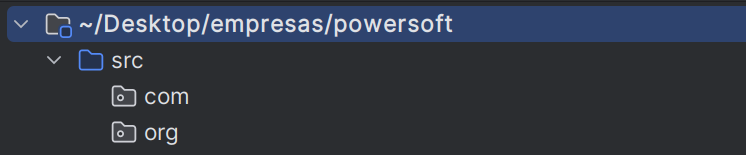

> A partir desta aula, as aulas ficaram contidas no diretório `src`. 

# Packages (pacotes)
Uma classe em Java é um arquivo que guarda instruções sobre como realizar/construir algo. 
No Java, existem classes que já vêm prontas, nos ajudando a adicionar novos recursos sem precisar criar tudo do zero. Essas milhares de classes ficam contidas em diversos __pacotes__. 
Um exemplo disso é a classe `Scanner` que fica contida no pacote `util`. Usamos  esta classe para
receber informações do usuário via terminal.

Um projeto simples pode ser composto por uma quantidade enorme de classes, cada uma desempenhando um papel 
específico no programa. Por exemplo, temos classes para tipos de dados, representação de texto, números, datas, 
conexão com bancos de dados, entre outras funcionalidades. Imagina todas essas classes existindo juntas em um 
único nível de documento? E as classes que foram desenvolvidas por nós para criar o programa? 
__Como ficaria a organização desse nosso diretório, hein?!__
> Os pacotes são, na verdade, subdiretórios contidos no diretório src. Eles são utilizados para organizar 
> nosso programa e também armazenam as classes usadas no desenvolvimento do programa.

 

### Analogia-01
Pode-se fazer uma analogia com um curso de matemática, onde o mesmo é organizado por seções. 
Por exemplo, teremos o primeiro módulo chamado 'Aritmética'. Pelo nome, já é de se esperar que os vídeos 
estejam relacionados a soma, subtração, divisão e assim por diante. 
Já no segundo módulo, chamado 'Álgebra', é de se esperar vídeos relacionados a equações, 
fatoração e outros temas similares. _Podemos imaginar que as seções são os pacotes, e as aulas desta seção são as classes._

> Imagem ilustrativa retirada da internet. 

 

### Analogia-02
Suponha que você goste de tirar muitas fotos e, ao mesmo tempo, valorize a organização. 
Para salvar suas fotos, você as deixa em seu PC. O diretório (pasta) que contém suas fotos poderia ser organizado 
da seguinte maneira: 

> As pastas 'fotosEspeciais', 'Animais', 'Viagens'.. São pacotes. E as fotos contidas nesses pacotes, são as classes.

 

________________

# Pacotes em prática

## Convenções
Para criar pacotes, existe uma convenção, ou seja, um método padronizado de organizá-los.
Uma forma simples de se entender uma convenção seria pensar na analogia-02. A pasta "pictures" é uma convenção, indicando o armazenamento de fotos.
O diretório "família" também segue uma convenção, sugerindo o armazenamento de fotos familiares.
Independentemente do usuário, a pasta "família" claramente sugere o conteúdo das fotos ali armazenadas.

Podemos concluir que, por mais que em Java temos o nome "pacote", este conceito já existe há muito tempo e é utilizado
em diversos lugares. A diferença é que, no Java, os pacotes não servem somente para organizar um projeto, mas os pacotes
contém funcionalidades que são usadas em diferentes parte do programa. 
 
## Exemplos
Imagine que você trabalhe para uma empresa chmada teachMore. A teachMore está desenvolvendo dois projetos, um site comercial
e um site intitucional sem fins lucrativos. 

Para estruturar ambos os projetos da empresa, começamos com o diretório chamado `src (source)`. 
O `src` será responsável por armazenar todos os projetos dessa empresa      .

- A url do site comercial será: __teachmore.com__ 
> O “com” no nome de domínio .com indica um site “comercial”. Isso pode abranger sites de negócios, sites que desejam ganhar dinheiro online , sites pessoais, blogs, portfólios e etc.

- A url do site institucional será: __teachmore.org__
> O nome `org` significa "organização". Um domínio '.org' foi projetado, no início, para ser usado em sites de organizações não-comerciais (sem fins lucrativos).

 

O projeto comercial será um site voltado para conectar professores de diferentes áreas com alunos que assinam planos.
Para um professor dar aula neste site por exemplo, ele precisa passar por diversas etapas, para ver se ele é capacitado
para lesionar suas aulas. Este projeto também pagará professores renomeados para dar aulas no site.

O projeto institucional será um site sem fins lucrativos, onde qualquer pessoa pode abrir sua sala de aula virtual e começar
a dar aula. Ele é voltado a pessoas que não querem/podem gastar com o ensino. A ideia é que o site seja mantido pela comunidade,
incluindo pessoas que desejam aprender e muitos professores que estão em inicio de carreira que querem aprender a ensinar. 
Mas é claro, nada impede de professores renomeados darem aula neste site também.

Para organizá-los no diretório da empresa, criaremos dois novos pacotes dentro do `src`.
O primeiro pacote, chamado `com`, conterá o projeto comercial.
O segundo pacote, chamado `org`, conterá o projeto insticucional. 

O pacote `com` é o pacote responsável por armazenar os projetos comerciais da empresa.
Então, por motivos obvio, colocaremos o nosos projeto comercial `teachmore` dentro deste pacote. 

Talvez tenha ficado um pouco estranho, pois o nome do nosso pacote `com` se tornou `com.teachmore`.
Na verdade, este ponto final, significa que estamos acessando o pacote `teachmore`.
Mas a realidade é que, até agora, já foram criados dois pacotes:
- com
- teachmore

Agora sim, colocaremos pacotes relacionados a funcionalidade da coisa. O nosso projeto
pode incluir pacotes chamados: controller, view, model, util.. 

