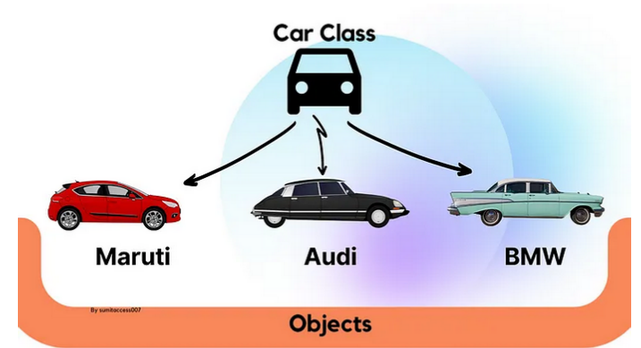

# Classes
Em Java, _todo arquivo é uma classe_. Em cada arquivo com extensão .java, encontramos o seguinte padrão:

```java
    public class nomeDoArquivo
    {
        // seu código aqui. . . 
    }
```

Normalmente, a classe principal é aquela que incorpora o método `public static void main(String[] args)`. 
Por meio deste método específico, é possível não apenas iniciar a execução do programa, mas também coordenar a 
execução de instruções, invocar outros métodos e instanciar objetos. Essencialmente, essa classe serve como a 
representação central do nosso programa, encapsulando a lógica inicial e coordenando as operações subsequentes.

<br>

# Objetos
Pense nos objetos do Java como representações digitais de objetos/entidades da vida real. 
Cada objeto, como uma caneca, possui diversas características, e na programação, são conhecidas como "propriedades" ou "atributos". 
Por exemplo, uma caneca pode incluir as propriedades como "cor", "altura" e "largura".

Essencialmente, um objeto é uma instância de uma __classe de domínio__. Esta classe, por exemplo, pode se chamar "Caneca", 
e ela serve como um modelo para a criação de objetos futuros. Os objetos criados com base nesta classe herdarão suas 
propriedades, mas cada instância pode ter valores diferentes para essas propriedades, refletindo as variações entre as 
entidades representadas.
```java
    public class Caneca
    {
        String cor;
        double altura; 
        double largura;
    }
```

Com a classe de domínio 'Caneca' criada, agora podemos ir para o nosso programa principal e instanciar (criar) objetos. 
Isso nos permite criar um número infinito de canecas, cada uma com valores únicos para as propriedades.

```java
    import Caneca; // linha responsável por importar a classe 'caneca' para o nosso arquivo "programaPrincipal". Sem este import, não podemos usar este classe.

    public class programaPrincipal
    {
        public static void main(String[] args) 
        {
            Caneca canecaParaCriancas = new Caneca();  
            
            canecaParaCriancas.cor = "blue"; 
            canecaParaCriancas.altura = 2.0;
            canecaParaCriancas.largura = 1.7;


            Caneca canecaParaAdultos = new Caneca();
            canecaParaCriancas.cor = "black";
            canecaParaCriancas.altura = 4.0;
            canecaParaCriancas.largura = 2.3;

        }
    }
```

<br>

Talvez o código não esteja totalmente claro, mas observe que, por meio da classe "Caneca", criamos duas canecas distintas, 
cada uma com valores de propriedades diferentes. Essas canecas, geradas a partir da classe "Caneca", são conhecidas como 
objetos. Tudo o que é instanciado a partir de uma classe é denominado objeto.

Podemos visualizar essa relação de classe e objetos através de uma representação visual. Neste contexto, considere o 
"carro" como nossa classe de domínio, atuando como um molde. Os carros individuais, como Maruti, Audi e BMW, representam os objetos 
que foram criados com base nesse molde (a classe).



<br>


E, é claro, objetos na programação podem representar não apenas coisas físicas, mas também entidades abstratas da 
vida real, como uma pessoa. Por exemplo, podemos ter um objeto chamado "Otavio", criado a partir de uma classe chamada Pessoa. 

```java
    public class Pessoa
    {
        String corDaPele;
        String nome; 
        int idade;
    }
```
```java
    import pessoa; 

    public class programaPrincipal
    {
        public static void main(String[] args) 
        {
            Pessoa otavio = new Pessoa();  
            
            otavio.corDaPele = "negro";
            otavio.nome = "Otavio";
            otavio.idade = 27; 
        }
    }
```
No exemplo acima, a classe Pessoa atua como um modelo, especificando as propriedades que uma pessoa pode ter. 
Em seguida, no programa principal, criamos uma instância dessa classe chamada "otavio", atribuindo valores específicos 
às suas propriedades. Isso demonstra como as classes podem ser usadas para modelar tanto objetos físicos quanto 
entidades conceituais na programação.