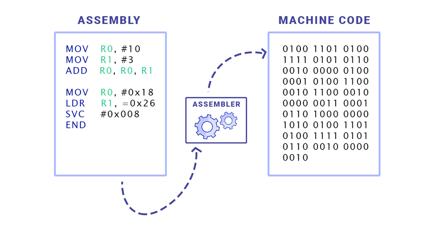
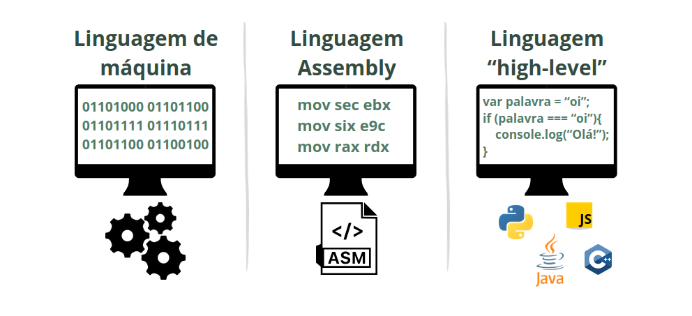

# Linguagem de máquina
A linguagem de máquina (ou linguagem de montagem) é a única linguagem que nossos computadores são capazes de compreender. Esta linguagem nada mais é do que uma sequência de bits (dígitos binários), ou seja, zeros e uns. O número 0 (zero) representa o **estado de desligado**, e o número 1 (um) representa o **estado de ligado**.
Com esta junção de dois estados, somos capazes de representar informações. No entanto, é importante notar que nossos computadores não armazenam literalmente os números 0 e 1. Esses valores são usados apenas para representar os estados mencionados, que se referem à passagem ou não de corrente elétrica.

Seria extremamente difícil e nada prático para nós, desenvolvedores, utilizá-la para a criação de software. Por isso, criamos as linguagens de programação de alto nível.

## Assembly
Nos primórdios da computação, surgiu o Assembly, que na época poderia ser considerado uma **linguagem de programação de nível mais próximo ao hardware**. A ideia por trás do assembly era trabalhar com uma linguagem um pouco mais compreensível e menos verbosa do que zeros e uns.

Por natureza, nossas máquinas são capazes de entender **apenas** código de máquina; qualquer outra linguagem não será compreendida pelos computadores. Assim, para concluir o desenvolvimento de um programa, o código em Assembly seria **traduzido para linguagem de máquina**, em um processo chamado de **compilação**.

___

## Linguagens de programação: High-level e low-level
Uma linguagem "high-level" é quando sua sintaxe é voltada para o entendimento humano. Isso significa que esse tipo de linguagem é muito mais intuitivo, amigável e mais fácil de compreender. Além disso, elas possuem uma alta portabilidade, isto é, são capazes de serem executadas diferentes tipos de sistemas sem grandes alterações.

Uma linguagem de programação de baixo nível é aquela em que a escrita do código é mais próxima da linguagem entendida pela máquina. Isso implica em uma sintaxe mais complexa e menos comandos intuitivos. 

Programas escritos em linguagens de baixo nível geralmente apresentam menor portabilidade. Por exemplo, em Java, o código fonte é compilado e adaptado com base no hardware do usuário. Quando desenvolvemos em Assembly, estamos escrevendo utilizando as intruções de um processador específico. Então, um código em assembly pode funcionar em um computador Y, mas não funcionar no computador X.

> Como podemos observar na imagem abaixo, as linguagens "high-level" (de alto nível) contêm palavras do vocabulário inglês. A linguagem assembly também as possui, mas em termos de complexidade na compreensão do código, ela é consideravelmente mais desafiadora.

___

### Diferentes formas de programar: Uma única forma de compreender.
Para criar um software nós podemos optar por linguagens de alto nível, como Java, C e C++ (...), ou adentrar o mundo das linguagens de baixo nível, como o Assembly. Porém, independente da linguagem escolhida, todas compartilham um propósito singular: passar por um processo de compilação para se traduzir em uma sequência de zeros e uns, pois ela é a __única__ linguagem que nossas máquinas conseguem compreender.

> Alguns podem argumentar que esta afirmação não se aplica às linguagens interpretadas, como o JavaScript, onde o código não é compilado diretamente para binário. Em vez disso, ele é interpretado por um motor, como o V8 do Google. No entanto, mesmo nesses casos, o código é eventualmente traduzido para linguagem de montagem para que a máquina possa compreendê-lo. No fim, tudo é **compilado**.

