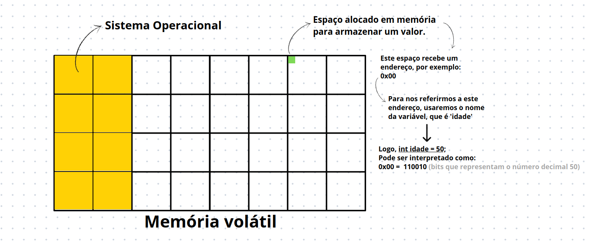

# Variáveis
Variávei é um conceito, essencialmente, abstrato. Este nome é utilizadp para dizer que determinada palavra-chave armazene um valor. 
Mas quando criamos uma variável, o que de fato está sendo feito por trás dos panos é:
1. Alocar um espaço em nossa memória RAM;
2. Este espaço recebe um endereço;
3. Atribuimos um valor para este endereço.



Então, quando imprimimos o valor da nossa variável usando `System.out.print(idade)`, na verdade, `idade` refere-se ao **endereço** do espaço alocado, que, por sua vez, armazena um valor. Por fim, este endereço retorna o valor que foi atribuído a ele.

___

## Variáveis em java
Em java, para criamos uma variável, precisamos de três coisas essencias:
1. Definir o __tipo de dado__ que esta variável irá armazenar;
2. Definir um __identificador__ para esta variável; 
3. __Atribuir um valor__ a esta variável. 
```java
    // Podemos fazer uma declaração e atribuir um valor, em uma única linha. 
    int idade = 50; 
    System.out.print(idade);
```
```java
    // Temos também a possibilidade de declarar uma variável e atruibur um valor a ela futuramente.
    int idade; 
    idade = 50;
    System.out.print(idade);
```

___

# Tipos de dados primitivos para variáveis
Quanto maior a quantidade bits, maior nossa capacidade de armazenar informações.

## 🔢 Tipos para valores numéricos
o número 10 utilzia apenas 4 bits para ser armazenado (1010), então, podemos utilizar `byte`.
Mas para representar o valor 40000, precisamos de outro tipo de dado.
- __`byte`__ é alocado espaço em memória de 8 bits (1 byte).
- __`short`__ é alocado espaço em memória de 16 bits (2 bytes). 
- __`int`__ é alocado espaço em memória de 32 bits.
- __`long`__ é alocado espaço em memória de 64 bits. 

- __`float`__ é alocado espaço em memória de 32 bits. A diferença entre o float e o int, é que o float aceita números decimais (números com vírgula, ex: 3.50)
- __`double`__ é alocado espaço em memória de 64 bits. A diferença entre o double e o long, é que o double aceita números decimais.

```java
    short idade = 77;
    int totalPessoasBrasileiras = 250000;
    long totalPessoasMundo = 8000000000L;
    float salario = 4000.50F;
```

<br>

## 🔤 Tipo para caracteres 
- __`char`__ é alocado um espaço em memória de 8 bits. Este espaço alocado em memória é utilizado para armazenar __somente__ 1 caracter, nada além disso. Não tente colocar, por exemplo, dois caracteres. Pois você estará tentando colocar 16 bits de informação em um espaço que aguenta apenas 8.  
```java
    // É possível informar um caracter de duas formas:
    char letra = 'a';
        // ou
    char letra = 65; 
```
> No fim, tanto a letra 'a' quanto o valor 65, representam o valor de `01100001` (8 bits).

<br>

## ❎ Tipo para representar verdadeiro/falso 
- __`boolean`__ ao declarar uma variável do tipo boolean, é alocado espaço em memória de 1 bit, este digito binário pode ser __zero__ ou __um__. Zero representa 'falso' e um representa 'verdadeiro'.
```java
    boolean isTodayCloudy = true;
    boolean isItRaining = true;
    boolean isMyWalletEmpty = false; 
    boolean sheHasADog = true; 
```
