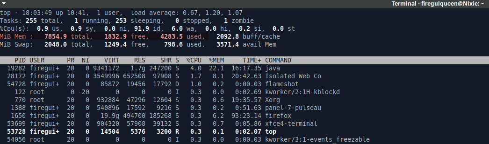
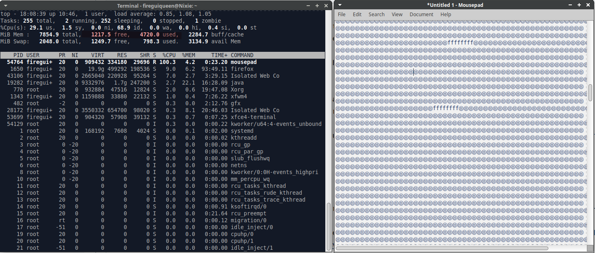

# Memória RAM
Uma medida essencial que tomamos é assegurar que haja memória RAM alocada em nossas máquinas. Essa memória é responsável por armazenar dados temporariamente.

Por exemplo, ao executar um software, como um sistema operacional, uma série de instruções ocorrem em segundo plano constantemente, resultando em alterações de valores que são temporariamente armazenadas em nossa memória RAM.

## Bloco de notas 
Quando iniciamos o Bloco de Notas e começamos a digitar, cada caractere que digitamos é armazenado temporariamente na memória RAM do computador. Isso significa que enquanto estamos digitando, a memória RAM está ativamente guardando cada letra, número ou símbolo que inserimos (em forma de bits, claro), permitindo que o sistema operacional processe e exiba esses dados em tempo real.

Na imagem abaixo, podemos observar os processos que estão em execução, juntamente com a quantidade total de memória RAM e a quantidade atualmente livre.

Ao inserir muitos caracteres, podemos ver uma redução significativa na quantidade de memória RAM disponível para uso. Isso ocorre porque cada caractere adicionado ao documento aumenta a carga sobre a memória RAM, uma vez que ela precisa armazenar temporariamente todos esses dados em seu espaço disponível.

